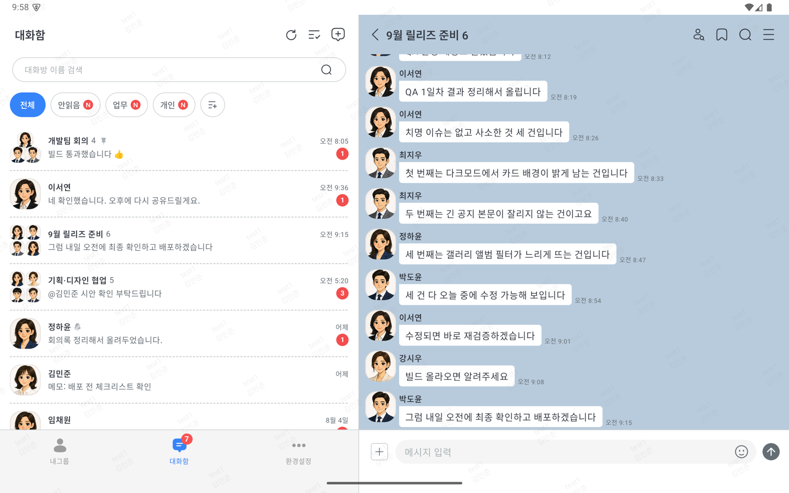
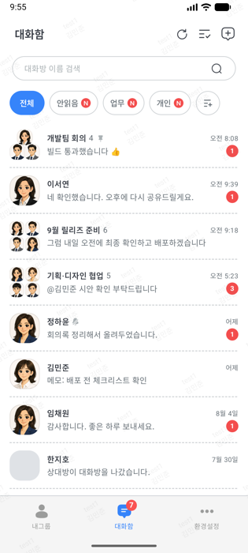
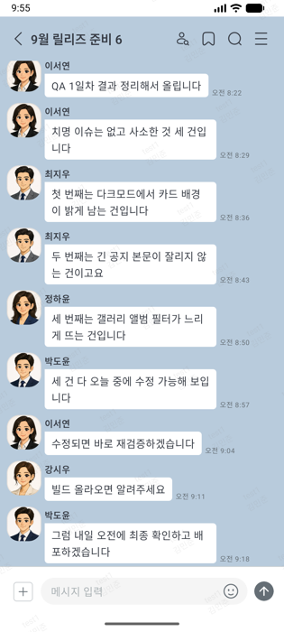
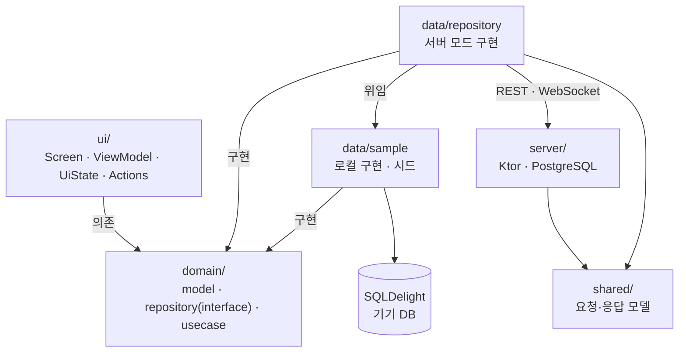

# Talk_Multiplatform

**Compose Multiplatform 으로 만든 Android · iOS 메신저 + Ktor 서버** — 서버 없이 기기 안 데이터만으로도, 서버에 붙어서도 동작합니다.


사내 메신저를 개발한 경험을 바탕으로 다시 만든 쇼케이스 프로젝트입니다. 두 가지 모드로 빌드됩니다.

- **로컬 모드** — 백엔드나 계정 없이 `installDebug` 한 번이면 실행됩니다. 대화·투표·공지가 기기 안 데이터베이스를 오가며 동작합니다.
- **서버 모드** — 같은 저장소의 Ktor 서버에 붙어 여러 사람이 실제로 주고받습니다. 화면과 도메인 계층은 로컬 모드와 같은 코드를 씁니다.

---

## 스크린샷

### 태블릿 — 가로 2-pane



화면이 넓어지면 대화함과 대화방을 나란히 배치합니다. 폴더블도 같은 레이아웃을 씁니다.

### 폰

| 대화함 | 대화방 |
|---|---|
|  |  |

---

## 주요 기능

### 대화
- 텍스트 · 이미지 · **동영상**(첫 프레임 썸네일 + 전체화면 재생) · 파일
- **이모티콘** — 정지/움직이는(GIF) 이모티콘, 탭 기억, 대화와 함께 전송
- **답장** — 스와이프 / 롱프레스, 원문 인용 후 원본으로 점프
- **멘션** — `@` 입력 시 참여자 자동완성, 멘션 수신 시 배지
- **공감(리액션)** — 같은 반응 재선택 시 토글 해제
- **공지** — 대화를 공지로 등록, 상단 배너(접기·숨기기), 전문 보기
- **투표** — 생성 · 참여 · 결과, 종료 시 1위 표시
- **책갈피** · **회수** · **검색**(사용자 · 날짜 필터)

### 대화방
- 목록 · 그룹(칩) 관리 · 상단고정 · 알림 설정 · 나가기 · 초대(1:1 중복 생성 방지)
- 안읽음 마커, 새 대화 배너, 최신으로 이동

### 미디어
- 사진 선택 시트, **앨범 폴더별 필터**, 다중 선택, 전체화면 뷰어, 갤러리 저장

### 그 외
- 내그룹(연락처) · 사용자 프로필 · **화면잠금**(PIN / 패턴 / 생체) · 공유(Share Intent)
- **다크모드** · **태블릿 · 폴더블 2-pane** · 한국어/영어 (문자열 369개, 양쪽 완전 일치)
- **전송 주체 전환** — 로컬 모드에서는 상대 대화를 만들 수 없으므로, 보내는 사람을 바꿔 대화 흐름을 재현하는 시연용 기능 (서버 모드에서는 숨김)

---

## 기술 스택

| 분류 | 사용 기술 |
|---|---|
| 언어 · UI | Kotlin 2.3.20, Compose Multiplatform 1.11.1, Material3 |
| 아키텍처 | Clean Architecture (ui / domain / data), MVVM |
| DI | Koin 4.2.1 |
| 네비게이션 | Voyager 1.0.1 |
| 기기 DB | SQLDelight 2.3.2 (테이블 11개) — 서버 모드에서는 캐시로 쓴다 |
| 설정 저장 | multiplatform-settings 1.3.0 |
| 이미지 | Coil 3.4.0 (+ GIF 디코더) |
| 직렬화 · 시간 | kotlinx.serialization 1.11.0, kotlinx-datetime 0.6.1 |
| 네트워크 | Ktor 3.4.2 클라이언트 (REST · WebSocket) |
| 서버 | Ktor 3.4.2 (Netty · WebSocket), HikariCP, Flyway, PostgreSQL 16 |
| Android 전용 | Firebase Messaging · Crashlytics, AndroidX Biometric |

**타깃** — Android `minSdk 24` / `targetSdk 36`, iOS `iosArm64` · `iosSimulatorArm64`

---

## 아키텍처



의존성은 **안쪽으로만** 흐릅니다. `domain` 은 `ui` · `data` 를 알지 못하고, Compose 타입도 쓰지 않습니다.
어느 구현을 쓸지는 Koin 모듈 한 곳에서 갈리므로, 서버를 붙이면서 화면과 도메인은 손대지 않았습니다.

```
composeApp/src/
├── commonMain/          326 files — 화면·도메인·데이터 대부분
│   ├── kotlin/com/eunilsung/talk/
│   │   ├── ui/          화면 (chatroom, chatroomlist, group, invite, setting …)
│   │   ├── domain/      model · repository(interface 15) · usecase(57)
│   │   ├── data/        sample(로컬 구현 + 시드) · repository(서버 모드 구현) · remote/server · mapper · local
│   │   └── di/          Koin 모듈
│   ├── sqldelight/      AppDatabase.sq
│   └── composeResources/ strings(ko·en) · drawable
├── androidMain/          32 files — actual 구현
├── iosMain/              32 files — actual 구현
└── commonTest/           29 files — 로직 + DB 통합 + 서버 모드 저장소 테스트
shared/                    3 files — 앱·서버가 함께 쓰는 요청·응답 모델
server/                   29 files — Ktor 서버 (+ 테스트 15 files, 마이그레이션 9개)
```

**화면 패턴** — 10개 ViewModel 이 `sealed UiState` 를 노출하고, 9개 화면이 `sealed Actions` 로 이벤트를 단방향 전달합니다.

---

## 로컬 데이터 설계

서버가 없어도 "진짜처럼" 동작하게 만든 부분입니다.

- **`data/sample/`** — 서버 자리를 대신하는 저장소 구현 12개와 시드 데이터.
  시드는 계정 10명, 대화방 7개, 방마다 대화 스크립트로 구성되며 최초 실행 시 DB에 적재됩니다.
- **단일 출처** — 대화방 목록의 안읽음·멘션 수를 하드코딩하지 않고 **대화 스크립트에서 도출**합니다.
  목록엔 12인데 방엔 5개뿐인 어긋남을 구조적으로 막았고, 테스트로 고정했습니다.
- **실제 CRUD** — 대화 전송·공지 등록·투표·책갈피가 모두 SQLDelight 를 거칩니다. 앱 재시작 후에도 유지됩니다.
- 시드를 바꿀 땐 `Config.Database.NAME` 을 올려 새 DB 로 시작합니다.

---

## 서버 모드 설계

`local.properties` 에 `server.baseUrl` 을 넣고 빌드하면 서버 모드가 됩니다.

- **화면은 계속 기기 DB 를 봅니다.** 서버 모드 저장소는 로컬 구현 위에 얹혀(`by local` 위임),
  서버에서 받은 것을 기기 DB 에 반영하고 사용자가 한 일을 서버로 보냅니다. 오프라인에서도 받아 둔 목록이 보입니다.
- **완결된 응답만 반영합니다.** 요청이 실패하면 가지고 있던 데이터를 그대로 둡니다. 공감·회수·공지처럼
  여러 사람이 동시에 건드리는 것은 화면에 먼저 그리지 않고 서버가 받아 준 결과만 그립니다.
- **대화 순서는 서버가 매긴 번호가 정합니다.** 단말 시계가 어긋나도 순서가 뒤집히지 않습니다.
  대화 id 는 앱이 만들고 재전송에도 바꾸지 않아, 응답을 못 받아 다시 보내도 대화가 두 번 생기지 않습니다.
- **계산할 수 있는 값은 저장하지 않습니다.** 안읽음 수는 참여자별 "어디까지 읽었는지"에서, 득표수는 표에서 셉니다.
  목록과 방의 숫자가 어긋날 자리를 구조적으로 없앴습니다.
- **바꾸는 요청은 REST, 알림은 WebSocket.** 알림은 "무엇이 바뀌었다"만 전하고, 앱은 연결될 때마다 다시 조회해
  끊겨 있던 동안의 변화를 메웁니다. 연결이 끊겨도 요청이 사라지지 않습니다.
- **신원은 토큰이 정합니다.** 비밀번호는 PBKDF2 해시로, 토큰은 SHA-256 해시로만 서버에 남습니다.
  참여 중이 아닌 방은 없는 방과 똑같이 답합니다.

| 기능 | 서버가 지키는 것 |
|---|---|
| 대화방 | 1:1 방은 누가 먼저 열어도 하나, 나중에 초대받은 사람은 그 전 대화를 보지 못함 |
| 읽음 | 읽은 자리는 뒤로 가지 않음, 나간 사람은 안읽음 수에서 빠짐 |
| 공감 · 회수 | 켤지 끌지를 서버가 정함, 회수하면 본문·파일·공감이 누구에게도 나가지 않음 |
| 파일 | 방 참여자만 받을 수 있고 나가면 못 받음, 파일 하나 20MB |
| 투표 | 하나만 고르는 투표엔 한 표, 끝내기는 만든 사람만 |
| 푸시 | 로그아웃하면 그 기기의 푸시 토큰도 함께 지워짐, 알림을 끈 방은 보내지 않음 |
| AI | 방에 초대해 `@AI` 로 부르는 참여자, 말풍선 번역, 보내기 전 글 다듬기(교정·정중하게·간결하게). 부른 사람이 볼 수 있는 대화만 모델에 보냄 |
| 로그인 | 틀린 비밀번호가 연달아 5번이면 5분 잠금 |

배포 구성(Docker · HTTPS 프록시)은 아직 없습니다. 푸시는 Firebase 서비스 계정 키를 넣어야 실제로 나갑니다. AI 는 Google Gemini 키(`GEMINI_API_KEY`)를 넣어야 답합니다.

---

## 테스트

**앱 191개 + 서버 112개, 그리고 진짜 서버에 붙여 도는 기능 테스트 11묶음(시나리오 24개).**

```bash
./gradlew :composeApp:testDebugUnitTest   # 앱 (Android JVM)
./gradlew :composeApp:allTests            # 앱 양 플랫폼
./gradlew :server:test                    # 서버 (내장 PostgreSQL)

# 기능 테스트 — 앱의 실제 통신 코드로 서버에 붙어 돈다. 로컬 서버는 알아서 뜨고 끝나면 내려간다
# Android Studio 에서는 실행 구성 "기능테스트 (실 서버)" 를 고르고 실행 버튼을 누른다
./gradlew :composeApp:testDebugUnitTest -PfunctionalTest=true --tests "*functest*"
```

| 대상 | 내용 |
|---|---|
| 순수 로직 | 대화 미리보기 토큰, 멘션 태그, 참여자 목록 인코딩 |
| 로컬 저장소 | 그룹 CRUD, 대화방 나가기·고정, 공감 토글, 공지, 책갈피, 시드 정합성 |
| 서버 모드 저장소 | 서버 대역을 끼워 전송 중 → 완료·실패, 재연결 따라잡기, 실패 시 되돌리기, 파일 내려받기 |
| 서버 저장소 | 실제 PostgreSQL 쿼리로 방·읽음·공감·회수·투표·그룹 규칙 |
| 기능 테스트 | 앱의 실제 REST·WebSocket 코드로 진짜 서버에 붙어 로그인·대화방·대화·읽음·공감/회수/공지/책갈피·파일·투표·그룹·초대·AI 를 끝에서 끝까지. 주소를 줬을 때만 돈다 |
| 서버 경로 | HTTP 와 WebSocket 을 거쳐 인증·권한·알림·푸시 대상 |

UI 테스트는 넣지 않았습니다. **저장소 계층은 실제 쿼리로 검증**하되,
화면은 유지보수 비용 대비 이득이 낮다고 판단했습니다.

- 앱의 인메모리 DB는 플랫폼별로 갈립니다 — Android 는 `JdbcSqliteDriver(IN_MEMORY)`,
  iOS 는 `NativeSqliteDriver(inMemory = true)`. iOS 는 **이름이 같으면 DB가 공유돼**
  케이스끼리 상태가 새는 문제가 있어, 매번 다른 이름을 부여합니다.
- 서버 테스트는 **설치 없이 뜨는 내장 PostgreSQL** 로 운영과 같은 Flyway 마이그레이션을 돌립니다.
  도커도 DB 설치도 필요 없고, 마이그레이션이 깨지면 여기서 먼저 드러납니다.
- 서버 모드 저장소 테스트는 Android(JVM)에서 돌렸습니다. iOS 시뮬레이터 실행은 아직 확인하지 않았습니다.

---

## 빌드 & 실행

JDK 17 이 필요합니다.

### 로컬 모드 (서버 없이)

```bash
./gradlew :composeApp:installDebug        # Android
open iosApp/iosApp.xcodeproj              # iOS — Xcode 에서 시뮬레이터를 골라 실행
```

### 서버 모드

```bash
./gradlew :server:runLocal                # 서버(8090) + 내장 PostgreSQL. 설치할 것이 없습니다
```

`local.properties` 에 서버 주소를 넣고 앱을 다시 빌드합니다.

```properties
# Android 에뮬레이터는 10.0.2.2, iOS 시뮬레이터는 localhost
server.baseUrl=http://10.0.2.2:8090
```

이 줄을 지우면 로컬 모드로 돌아갑니다.

### 로그인

| ID | PW |
|---|---|
| `test1` ~ `test10` | `1234` |

로컬 모드는 기기 안 계정으로, 서버 모드는 서버가 처음 뜰 때 만들어 둔 같은 계정으로 로그인합니다.

---

## 기술적으로 볼만한 지점

### 1. KMP 플랫폼 추상화를 두 방식으로 나눠 씀
플랫폼 UI(카메라 열기, 뒤로가기 처리 등)는 `expect fun` 으로, 주입이 필요한 서비스
(파일 메타데이터, 사진 조회, 생체인증 등)는 **인터페이스 + DI** 로 갈랐습니다.
후자는 테스트에서 Fake 로 대체할 수 있어 저장소 테스트가 가능해집니다.

### 2. 키보드와 이모티콘 패널의 높이 동기화
OS 키보드와 이모티콘 패널이 번갈아 뜰 때 하단바가 흔들리거나 잘리는 문제를,
`stableImeHeight` 하나가 맡던 세 가지 역할을 **단일 애니메이션 타깃 + `reserved` 래칫**으로
분리해 해결했습니다. 실기기 프레임 단위 측정으로 확인했습니다.

### 3. 리컴포지션 범위 좁히기
도메인 모델을 `@Immutable` 로 안정화해 리스트 아이템이 skip 되게 하고,
스크롤·IME 같은 **프레임 단위 상태를 `snapshotFlow` · `derivedStateOf` · `Modifier.offset{}`** 으로
내려 화면 전체가 매 프레임 재구성되지 않도록 정리했습니다.

### 4. 양 플랫폼에서 도는 DB 통합 테스트
`commonTest` 하나로 Android·iOS 양쪽에서 **실제 SQL을 실행**해 검증합니다.
덕분에 "Android 는 통과하는데 iOS 만 깨지는" 문제(인메모리 DB 이름 공유)를 실제로 잡았습니다.

### 5. 대화방 화면 분해
1,480줄 / 단일 함수 973줄이던 대화방 화면을 상단바 · 하단바 · 목록 ·
**스크롤 컨트롤러**(진입 마커 배치, 검색 포커스, 전송 후 이동 등 5개 이펙트) ·
액션 메뉴로 나눠 각 조각을 독립적으로 볼 수 있게 했습니다.

---

## 규모

| 항목 | 값 |
|---|---|
| Kotlin 파일 | 469개 (앱 419 · 공유 3 · 서버 44, 테스트 포함) |
| 코드 라인 | 49,079줄 |
| Repository 인터페이스 / UseCase | 15 / 57 |
| ViewModel / Actions | 10 / 9 |
| 기기 DB 테이블 / 서버 DB 테이블 | 11개 / 18개 |
| 문자열 리소스 | 369개 (ko · en) |
| 테스트 | 303개 (앱 191 · 서버 112) + 기능 테스트 11묶음 |
