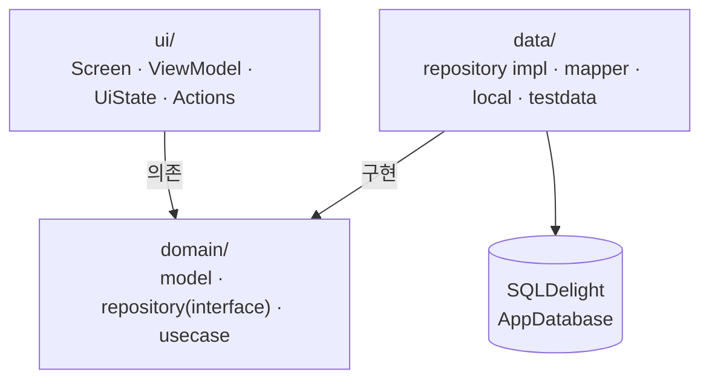

# MultiplatformTalk

**Compose Multiplatform 으로 만든 Android · iOS 메신저** — 서버 없이 로컬 데이터만으로 동작합니다.


사내 메신저를 개발한 경험을 바탕으로, **서버 의존을 걷어내고 혼자서도 실행·검증할 수 있게** 다시 만든 쇼케이스 프로젝트입니다.
백엔드나 계정 없이 `installDebug` 한 번이면 바로 실행되며, 대화·투표·공지 같은 기능이 실제 데이터베이스를 오가며 동작합니다.

---

## 스크린샷

### 태블릿 — 가로 2-pane


화면이 넓어지면 대화함과 대화방을 나란히 배치합니다. 폴더블도 같은 레이아웃을 씁니다.

### 폰

| 대화함 | 대화방 |
|---|---|
|  |  |

---

## 주요 기능

### 대화
- 텍스트 · 이미지 · **동영상**(첫 프레임 썸네일 + 전체화면 재생) · 파일
- **이모티콘** — 정지/움직이는(GIF) 이모티콘, 탭 기억, 대화와 함께 전송
- **답장** — 스와이프 / 롱프레스, 원문 인용 후 원본으로 점프
- **멘션** — `@` 입력 시 참여자 자동완성, 멘션 수신 시 배지
- **공감(리액션)** — 같은 반응 재선택 시 토글 해제
- **공지** — 대화를 공지로 등록, 상단 배너(접기·숨기기), 전문 보기
- **투표** — 생성 · 참여 · 결과, 종료 시 1위 표시
- **책갈피** · **회수** · **검색**(사용자 · 날짜 필터)

### 대화방
- 목록 · 그룹(칩) 관리 · 상단고정 · 알림 설정 · 나가기 · 초대(1:1 중복 생성 방지)
- 안읽음 마커, 새 대화 배너, 최신으로 이동

### 미디어
- 사진 선택 시트, **앨범 폴더별 필터**, 다중 선택, 전체화면 뷰어, 갤러리 저장

### 그 외
- 내그룹(연락처) · 사용자 프로필 · **화면잠금**(PIN / 패턴 / 생체) · 공유(Share Intent)
- **다크모드** · **태블릿 · 폴더블 2-pane** · 한국어/영어 (문자열 353개, 양쪽 완전 일치)
- **전송 주체 전환** — 서버가 없어 상대 대화를 만들 수 없으므로, 보내는 사람을 바꿔 대화 흐름을 재현하는 시연용 기능

---

## 기술 스택

| 분류 | 사용 기술 |
|---|---|
| 언어 · UI | Kotlin 2.3.20, Compose Multiplatform 1.11.1, Material3 |
| 아키텍처 | Clean Architecture (ui / domain / data), MVVM |
| DI | Koin 4.2.1 |
| 네비게이션 | Voyager 1.0.1 |
| 로컬 DB | SQLDelight 2.3.2 (테이블 11개) |
| 설정 저장 | multiplatform-settings 1.3.0 |
| 이미지 | Coil 3.4.0 (+ GIF 디코더) |
| 직렬화 · 시간 | kotlinx.serialization 1.11.0, kotlinx-datetime 0.6.1 |
| 네트워크 | Ktor 3.4.2 *(링크 미리보기 전용)* |
| Android 전용 | Firebase Messaging · Crashlytics, AndroidX Biometric |

**타깃** — Android `minSdk 24` / `targetSdk 36`, iOS `iosArm64` · `iosSimulatorArm64`

---

## 아키텍처



의존성은 **안쪽으로만** 흐릅니다. `domain` 은 `ui` · `data` 를 알지 못하고, Compose 타입도 쓰지 않습니다.

```
composeApp/src/
├── commonMain/          307 files — 화면·도메인·데이터 대부분
│   ├── kotlin/com/eunilsung/talk/
│   │   ├── ui/          화면 (chatroom, chatroomlist, group, invite, setting …)
│   │   ├── domain/      model · repository(interface 15) · usecase(57)
│   │   ├── data/        구현체 · mapper · local(플랫폼 추상화) · testdata(시드)
│   │   └── di/          Koin 모듈
│   ├── sqldelight/      AppDatabase.sq
│   └── composeResources/ strings(ko·en) · drawable
├── androidMain/          29 files — actual 구현
├── iosMain/              28 files — actual 구현
└── commonTest/           13 files — 로직 + DB 통합 테스트
```

**화면 패턴** — 10개 ViewModel 이 `sealed UiState` 를 노출하고, 9개 화면이 `sealed Actions` 로 이벤트를 단방향 전달합니다.

---

## 로컬 데이터 설계

서버가 없어도 "진짜처럼" 동작하게 만든 부분입니다.

- **시드 데이터** (`data/testdata/`) — 계정 10명, 대화방 7개, 방마다 대화 스크립트. 최초 실행 시 DB에 적재됩니다.
- **단일 출처** — 대화방 목록의 안읽음·멘션 수를 하드코딩하지 않고 **대화 스크립트에서 도출**합니다.
  목록엔 12인데 방엔 5개뿐인 어긋남을 구조적으로 막았고, 테스트로 고정했습니다.
- **실제 CRUD** — 대화 전송·공지 등록·투표·책갈피가 모두 SQLDelight 를 거칩니다. 앱 재시작 후에도 유지됩니다.
- 시드를 바꿀 땐 `Config.Database.NAME` 을 올려 새 DB 로 시작합니다.

---

## 테스트

**69개, Android(JVM) · iOS(시뮬레이터) 양쪽에서 동일하게 통과합니다.**

```bash
./gradlew :composeApp:allTests            # 양 플랫폼
./gradlew :composeApp:testDebugUnitTest   # Android 만 (빠름)
```

| 대상 | 내용 |
|---|---|
| 순수 로직 | 대화 미리보기 토큰, 멘션 태그, 참여자 목록 인코딩 |
| 저장소 통합 | 그룹 CRUD, 대화방 나가기·고정, 1:1 방 중복 생성 방지 |
| 대화 저장소 | 공감 토글, 공지 등록·삭제, 책갈피, 회수 플래그 DB 왕복 |
| 읽음 처리 | 방 진입 시 안읽음·멘션 0, 다른 방 미영향 |
| 시드 정합성 | 목록의 안읽음·멘션 수가 실제 대화와 일치하는지 |

UI 테스트는 넣지 않았습니다. **저장소 계층은 실제 쿼리로 검증**하되,
화면은 유지보수 비용 대비 이득이 낮다고 판단했습니다.

인메모리 DB는 플랫폼별로 갈립니다 — Android 는 `JdbcSqliteDriver(IN_MEMORY)`,
iOS 는 `NativeSqliteDriver(inMemory = true)`. iOS 는 **이름이 같으면 DB가 공유돼**
케이스끼리 상태가 새는 문제가 있어, 매번 다른 이름을 부여합니다.

---

## 빌드 & 실행

### Android

```bash
./gradlew :composeApp:installDebug
```

### iOS

```bash
open iosApp/iosApp.xcodeproj
```

Xcode 에서 시뮬레이터를 골라 실행합니다.

### 로그인

서버가 없어 **아무 테스트 계정으로 로그인**하면 됩니다.

| ID | PW |
|---|---|
| `test1` ~ `test10` | `1234` |

---

## 기술적으로 볼만한 지점

### 1. KMP 플랫폼 추상화를 두 방식으로 나눠 씀
플랫폼 UI(카메라 열기, 뒤로가기 처리 등)는 `expect fun` 으로, 주입이 필요한 서비스
(파일 메타데이터, 사진 조회, 생체인증 등)는 **인터페이스 + DI** 로 갈랐습니다.
후자는 테스트에서 Fake 로 대체할 수 있어 저장소 테스트가 가능해집니다.

### 2. 키보드와 이모티콘 패널의 높이 동기화
OS 키보드와 이모티콘 패널이 번갈아 뜰 때 하단바가 흔들리거나 잘리는 문제를,
`stableImeHeight` 하나가 맡던 세 가지 역할을 **단일 애니메이션 타깃 + `reserved` 래칫**으로
분리해 해결했습니다. 실기기 프레임 단위 측정으로 확인했습니다.

### 3. 리컴포지션 범위 좁히기
도메인 모델을 `@Immutable` 로 안정화해 리스트 아이템이 skip 되게 하고,
스크롤·IME 같은 **프레임 단위 상태를 `snapshotFlow` · `derivedStateOf` · `Modifier.offset{}`** 으로
내려 화면 전체가 매 프레임 재구성되지 않도록 정리했습니다.

### 4. 양 플랫폼에서 도는 DB 통합 테스트
`commonTest` 하나로 Android·iOS 양쪽에서 **실제 SQL을 실행**해 검증합니다.
덕분에 "Android 는 통과하는데 iOS 만 깨지는" 문제(인메모리 DB 이름 공유)를 실제로 잡았습니다.

### 5. 대화방 화면 분해
1,480줄 / 단일 함수 973줄이던 대화방 화면을 상단바 · 하단바 · 목록 ·
**스크롤 컨트롤러**(진입 마커 배치, 검색 포커스, 전송 후 이동 등 5개 이펙트) ·
액션 메뉴로 나눠 각 조각을 독립적으로 볼 수 있게 했습니다.

---

## 규모

| 항목 | 값 |
|---|---|
| Kotlin 파일 | 379개 |
| 코드 라인 | 36,383줄 |
| Repository 인터페이스 / UseCase | 15 / 57 |
| ViewModel / Actions | 10 / 9 |
| DB 테이블 | 11개 |
| 문자열 리소스 | 353개 (ko · en) |
| 테스트 | 69개 |
